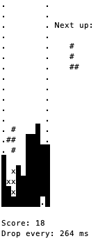

Tetris for the terminal, implemented in C++

# Preview
Try the preview [here](http://terminaltetris.grutter.repl.run/)

(Sorry, it's not a web app, there will be input lag)

# Setup
This works for me:

`clang++ -std=c++17 -lncurses -o tetris src/main.cpp`

If you don't have `clang++`, you might have `g++`.

You'll need `ncurses` installed for linking.

# Playing

Run `./tetris`.

Keys are WASD or the arrows, and space to drop the piece.

Big font size encouraged.

# My terminal is messed up after playing it.

That's an `ncurses` thing, type `reset`.
